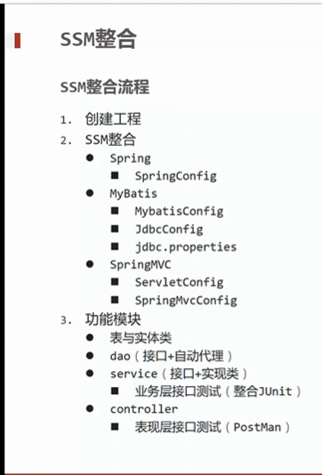

# 这是一个SpringMVC的学习项目

## SSM整合

1. **创建工程**
2. **SSM整合**
    - **Spring**
        - SpringConfig
    - **MyBatis**
        - MyBatisConfig
        - JdbcConfig
        - jdbc.properties
    - **SpringMVC**
        - SpringMvcConfig
        - ServletConfig
3. **模块功能**
    - 表与实体类
    - DAO (接口 + 自动代理)
    - Service (接口 + 实现类)
        - 业务层接口测试 (整合JUnit)
    - Controller
        - 表现层接口测试 (Postman)

